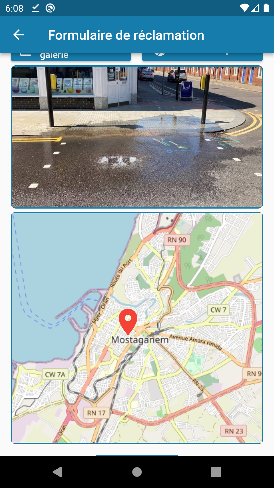
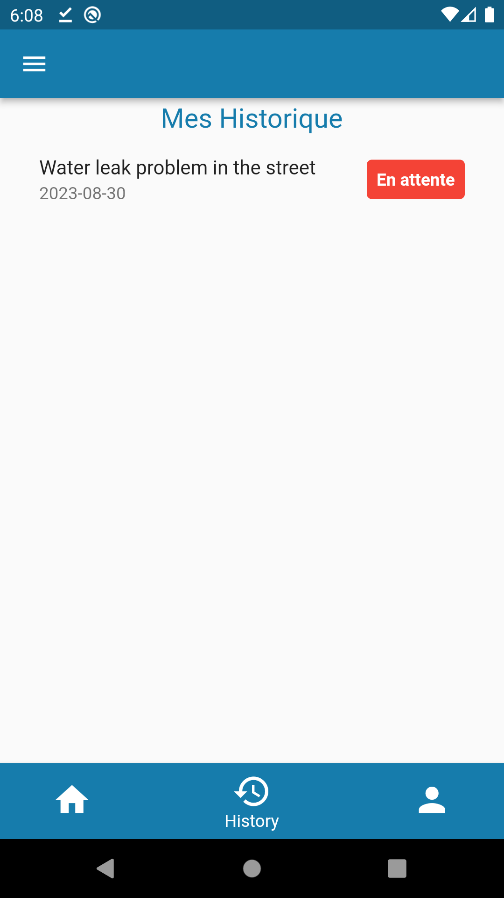
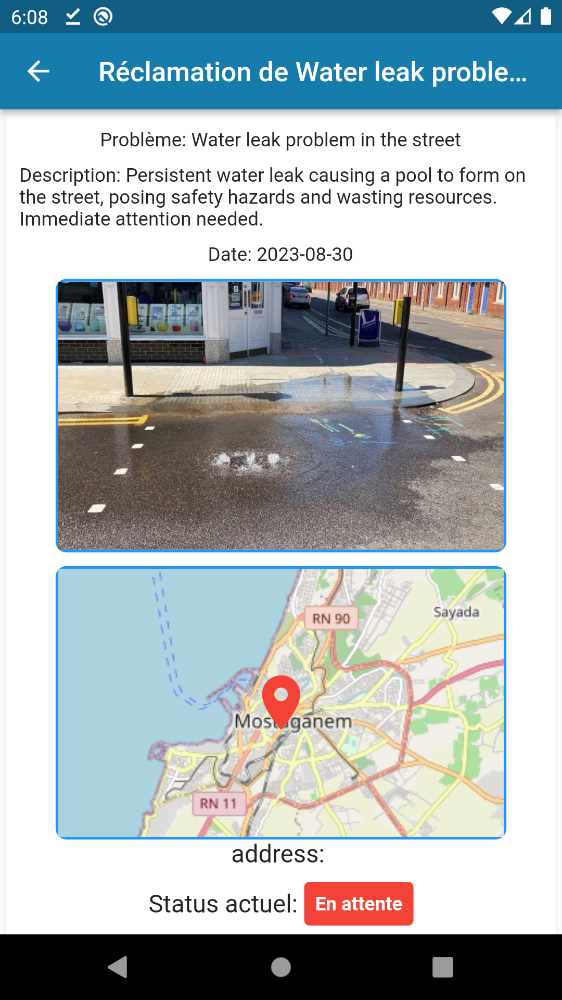
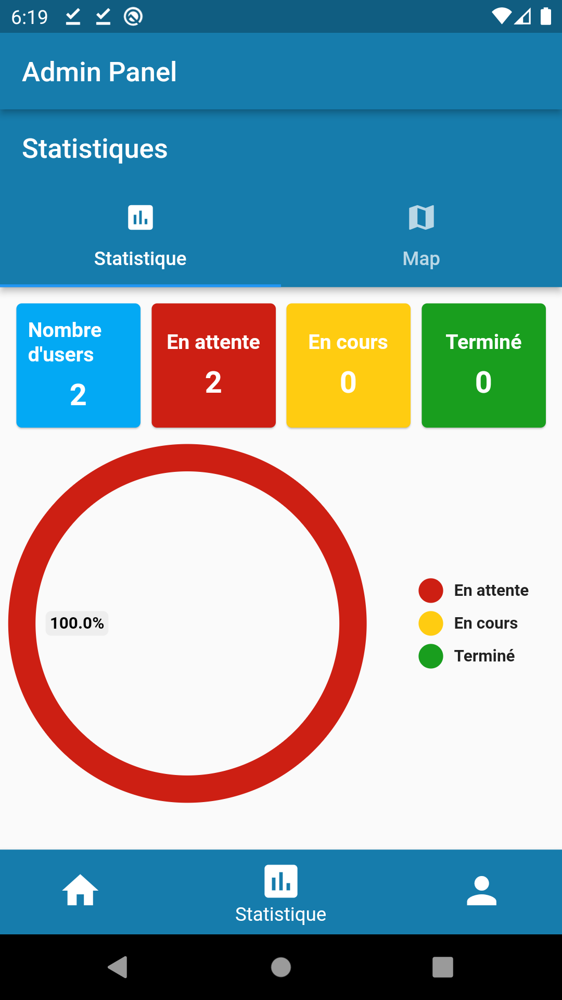
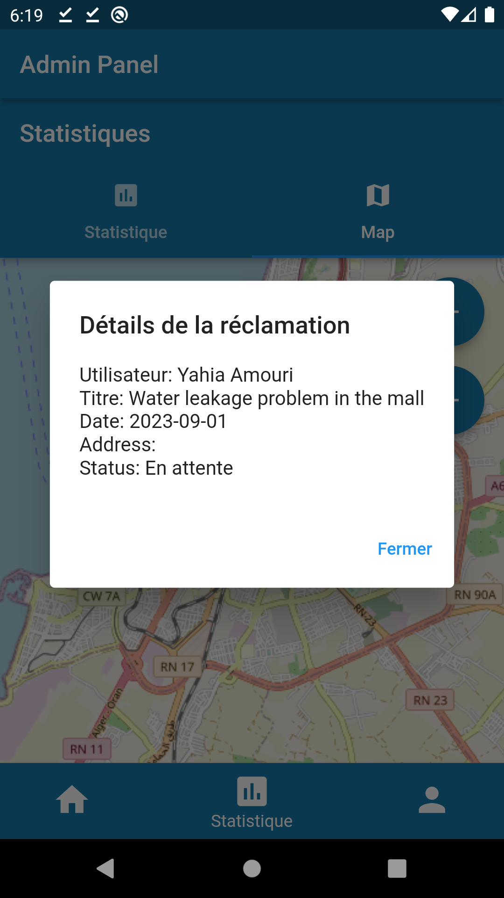
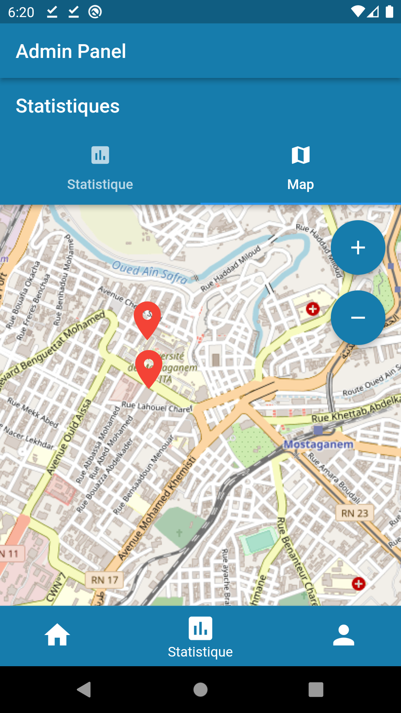
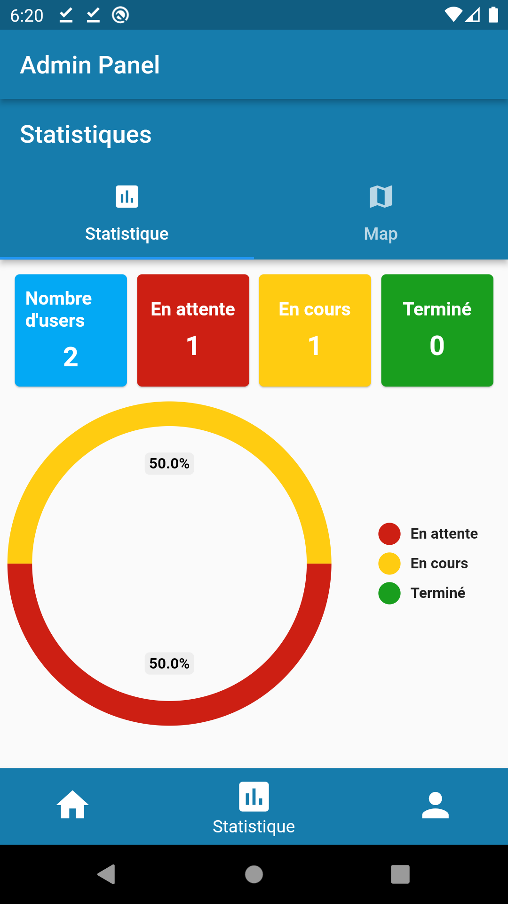
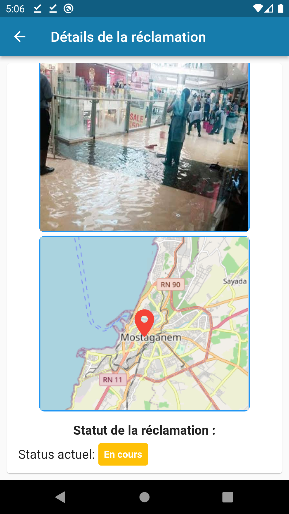

# The mobile water leak claim application : ChakwaMob

# 1- Description :

The mobile application for reporting water leaks is a user-friendly and efficient platform developed using Flutter and Firebase, designed to enable users to report and manage water leaks in real-time. Whether at home, in the office, or within the community, our application aims to simplify the process of reporting water leaks and ensure a swift response to minimize losses and damages.

# 2- Key Features:

- Easy Reporting: Users can report water leaks by providing details such as location, leak severity, and a description. Photos can also be added to aid in identification.

- Real-time Tracking: Once a report is submitted, users can track the status of their request in real-time, from submission to resolution. This allows for complete transparency in the process.

- Efficient Management: Agents responsible for leak resolution have access to a dedicated interface where they can sort, prioritize, and assign claims. They can also update the status of each claim as it progresses.

- Integrated Mapping: An embedded map allows users to precisely locate the water leak, thus facilitating the localization and intervention process.

- Claims History: Users have access to a comprehensive history of their past claims, which can be useful for future reference.

# 3- Technologies Used:

- Flutter: A cross-platform app development framework that enables the creation of attractive and smooth user interfaces for both Android and iOS from a single source code.

- Firebase: A Google mobile app development platform, offering a range of tools such as authentication, real-time database, file storage, and push notifications.

- To access his account as admin:
- Username = admin
- Password = admin123

# 4- Screenshots:

# 5- Authors:

This app was developed with love by [madanimohadhabib](https://github.com/madanimohadhabib)